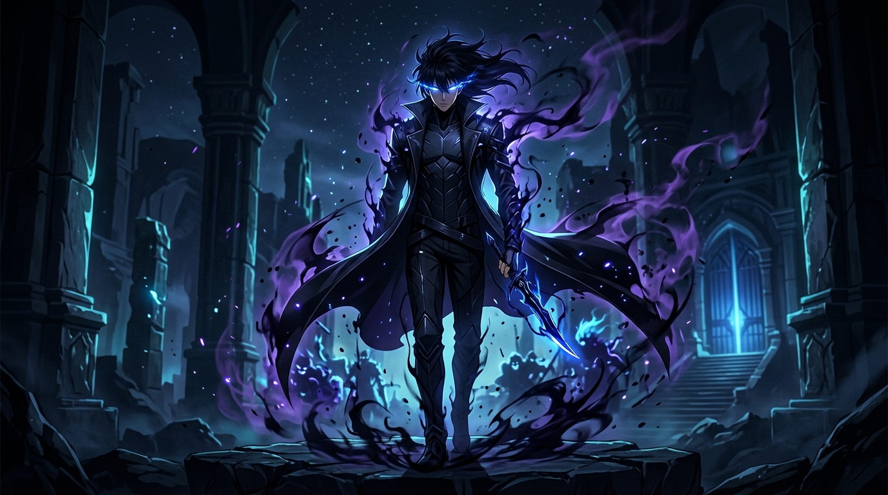

# Solo Leveling — The System & Shadow Monarch Experience

A premium, cinematic, highly interactive web application inspired by the anime **Solo Leveling**. Built to feel like entering the actual Solo Leveling "System" rather than a conventional fan website.



---

## ⚡ Overview

This project is a high-end frontend showcase delivering a dark, mysterious, and sophisticated cinematic experience. Every interaction, transition, and micro-animation is crafted to mimic the holographic "System" windows encountered by Sung Jin-Woo.

### Key Features

1. **System Loading Protocol**
   - Cinematic sequence: `SYSTEM INITIALIZING...` → `LOADING SHADOW CORE...` → Animated progress counter → `SYSTEM ONLINE` → Automatic exit transition revealing the Hero.
   - Built with deterministic fallback timeouts and failsafe guarantees.

2. **Cinematic Hero Experience**
   - Deep multi-layered depth architecture: background atmosphere, architectural environment, volumetric fog/mist, shadow mana particles, character silhouette, interactive foreground particles, and futuristic HUD typography.
   - Responsive mouse parallax effect (disabled on touch devices) and subtle idle character breathing motion.
   - Ambient Web Audio synthesis (synthesized system chimes, pings, gate alarms, and the resonant `ARISE.` invocation without external audio dependencies).

3. **Player Status HUD (System Status)**
   - Holographic System window modeled after Sung Jin-Woo's stats interface.
   - Dynamic stat meters (Strength, Agility, Sense, Vitality, Intelligence, HP, MP).
   - Interactive stat distribution allocator points with real-time feedback.

4. **Hunter Canon Database**
   - Official anime canon classification (Season 1 & Season 2 "Arise from the Shadow").
   - Detailed hunter profiles with verified ranks (E through National Level), guilds, combat types, abilities, and tactical analysis.
   - Interactive character detail modals and inspection tools.

5. **Shadow Army Materialization**
   - Roster of extracted shadow soldiers (Igris, Beru, Tank, Iron, Kaisel, Shadow Infantry).
   - Materialization animations, rank designations, commander stats, and interactive `ARISE` extraction effects.

6. **Dimensional Gate Detection System**
   - Gate registry classified by mana wave frequencies (E-Rank to S-Rank Red Gates).
   - Threat level indicators, boss entity breakdowns, and expedition party requirements.
   - Interactive Gate analysis modal with radar ping visualizations.

7. **Daily Quest Protocol**
   - Replica of the "Preparations to Become Strong" daily quest (Push-ups, Curl-ups, Squats, 10km Run).
   - Interactive checklist with completion status and reward notification.

8. **Hunter License Generator**
   - Personalized hunter evaluation system with persistent localStorage saving.
   - Generates official hunter identification cards with custom ranks, classes, and combat ratings.

9. **Anime Chronicle & Broadcast Archive**
   - Episode breakdowns across Season 01 and Season 02 with official synopses and arc tracking.

---

## 🛠️ Technology Stack

- **Framework**: [React 19](https://react.dev/) + [TypeScript](https://www.typescriptlang.org/)
- **Build Tool**: [Vite](https://vitejs.dev/)
- **Styling**: [Tailwind CSS v4](https://tailwindcss.com/)
- **Animations**: [GSAP](https://greensock.com/gsap/) (ScrollTrigger) & [Motion](https://motion.dev/)
- **Smooth Scrolling**: [Lenis](https://lenis.darkroom.engineering/)
- **Icons**: [Lucide React](https://lucide.dev/)
- **Audio**: Custom procedural Web Audio API synthesizer

---

## 🚀 Getting Started

### Prerequisites

- Node.js (v18 or higher recommended)
- npm, yarn, pnpm, or bun

### Installation

```bash
# Clone the repository
git clone <repository-url>

# Navigate into the project directory
cd solo-leveling-system

# Install dependencies
npm install
```

### Development

```bash
# Start local development server
npm run dev
```

The app will be available at `http://localhost:3000`.

### Production Build

```bash
# Build for production
npm run build

# Preview production build locally
npm run preview
```

### Type Checking & Linting

```bash
# Run TypeScript compilation check
npm run lint
```

---

## 📂 Project Structure

```text
├── index.html                  # HTML entry point with fonts & meta tags
├── metadata.json               # Application metadata & capabilities
├── package.json                # Project dependencies and scripts
├── tsconfig.json               # TypeScript compiler configuration
├── vite.config.ts              # Vite configuration with Tailwind CSS plugin
├── src/
│   ├── main.tsx                # Application bootstrap
│   ├── App.tsx                 # Core app orchestrator & layout
│   ├── index.css               # Global styles, typography & cinematic animations
│   ├── assets/                 # Generated cinematic anime imagery & artwork
│   │   └── images/
│   ├── components/             # Reusable System UI components
│   │   ├── CustomCursor.tsx    # Dual-ring glowing interactive cursor
│   │   ├── LoadingScreen.tsx   # System boot protocol with failsafe
│   │   ├── Navbar.tsx          # Top bar navigation & audio toggle
│   │   ├── ManaParticleCanvas.tsx # Canvas mana particle background
│   │   ├── Hero.tsx            # Multi-layered parallax cinematic hero
│   │   ├── SystemStatus.tsx    # Player status window & stat allocator
│   │   ├── CharacterGallery.tsx# Hunter roster & inspection modal
│   │   ├── ShadowArmy.tsx      # Shadow extraction & materialization
│   │   ├── GateSystem.tsx      # Dimensional gate radar & classification
│   │   ├── QuestSystem.tsx     # Daily quest protocol & penalty zone
│   │   ├── HunterProfile.tsx   # Interactive Hunter License generator
│   │   ├── EpisodeSection.tsx  # Season 1 & 2 chronicle archive
│   │   ├── Footer.tsx          # Cinematic Arise terminal conclusion
│   │   └── ...                 # System modals & detail drawers
│   ├── data/                   # Structured Solo Leveling canon database
│   │   ├── soloLevelingData.ts # Unified dataset
│   │   ├── characters.ts       # Hunter profiles & combat stats
│   │   ├── shadows.ts          # Shadow soldier army entries
│   │   ├── gates.ts            # Dimensional rift records
│   │   ├── episodes.ts         # Episode summaries & broadcast data
│   │   └── ...
│   ├── types/                  # Strict TypeScript interfaces & canon models
│   │   ├── index.ts
│   │   └── canon.ts
│   └── utils/
│       └── audio.ts            # Synthesized procedural Web Audio engine
```

---

## 🛡️ License

This project is licensed under the Apache 2.0 License.
